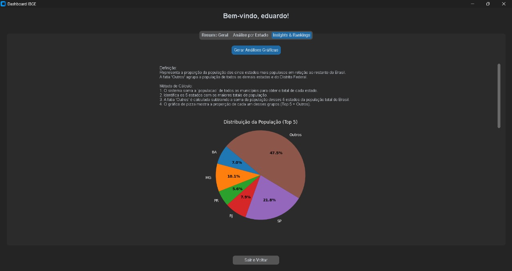
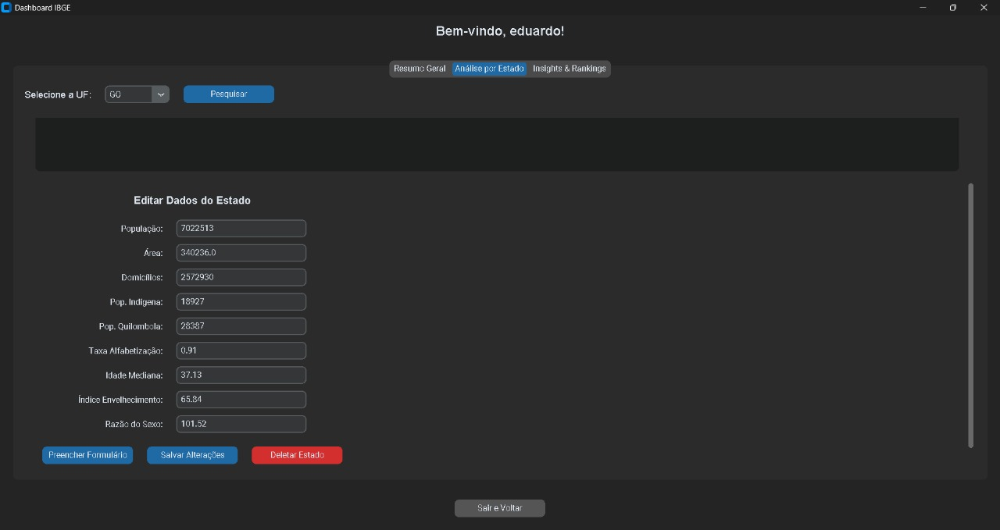
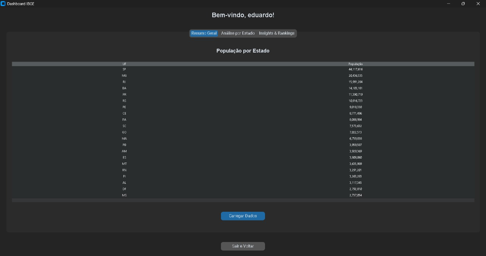
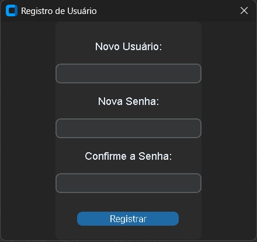
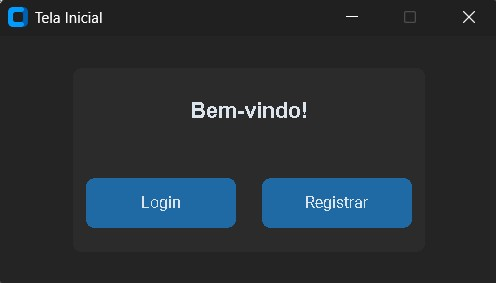

# Edita Censo - Populações Indígenas e Quilombolas


> **Status do Projeto:** ✔️ Concluído

## 📝 Descrição

O projeto **Edita Censo** foi desenvolvido para visualizar e gerenciar dados sobre as populações quilombolas e indígenas em cada estado do Brasil. A principal motivação foi dar maior visibilidade a esses grupos, que muitas vezes não recebem a mesma atenção que outras populações. O sistema permite que os dados sejam atualizados manualmente, utilizando como referência os lançamentos anuais da PNAD (Pesquisa Nacional por Amostra de Domicílios Contínua), garantindo um controle demográfico preciso.

## ✨ Funcionalidades Principais

O sistema oferece uma gama de funcionalidades para a gestão e análise dos dados demográficos:

* Autenticação de Usuários: Sistema de login e registro do usuário. 
* Visualização de Dados: Carregamento e exibição da população total por estado. 
* Busca Específica: Sistema de pesquisa por UF. 
* Gerenciamento de Dados (CRUD):
    * Editar informações do sistema. 
    * Excluir dados do sistema. 
* Análise Gráfica:
    * Gráficos interativos para visualização dos dados. 
    * Análises e rankings para comparações entre estados. 

## 🛠️ Tecnologias Utilizadas

* **Linguagem:** Python
* **Frameworks e Bibliotecas:**
    * Tkinter & Customtkinter
    * Flask
    * Matplotlib
    * Pandas
* **Banco de Dados:** SQLite
* **Ferramentas:** VSCode, Git e GitHub. 
* **Metodologia:** Desenvolvimento Rápido de Aplicações (RAD). 

## 📊 Base de Dados

Os dados utilizados são públicos e foram coletados da plataforma **Base dos Dados**. O formato foi tratado como `.CSV` e as principais colunas utilizadas foram: 

* `Populacao`: População geral dos estados. 
* `populacao_indigena`: População indígena por estado. 
* `populacao_quilombola`: População quilombola por estado. 
* `Area`: Área total do estado em km². 
* `Densidade Demografica`: População por km². 
* `Idade Mediana`: Idade mediana da população do estado. 
* `Indice Envelhecimento`: Índice de envelhecimento da população. 
* `Razao Sexo`: Proporção entre homens e mulheres. 
* `Taxa Alfabetizacao`: Percentual de pessoas com mais de 15 anos alfabetizadas. 
* `Media Moradores Domicilio`: Média de moradores por domicílio. 

## ⚙️ Como Instalar e Executar o Projeto

Siga os passos abaixo para configurar e rodar o ambiente de desenvolvimento.

### 1. Preparando o Ambiente

Primeiro, clone o repositório para a sua máquina local:

```bash
git clone https://github.com/edusabi/edita_senso
cd src
```

### 2. Instalando as Dependências

É recomendado criar um arquivo `requirements.txt` com todas as bibliotecas necessárias. Se não tiver um, instale as dependências manualmente:

```bash
pip install flask matplotlib pandas customtkinter
```

### 3. Executando o Sistema

Este projeto precisa que dois componentes rodem ao mesmo tempo: o backend (API) e a interface gráfica (GUI). Para isso, você precisará abrir dois terminais na pasta do projeto.

**No Terminal 1 - Execute o Backend (`app.py`):**

```bash
python app.py
```

Deixe este terminal aberto. Ele é responsável por gerenciar os dados e a lógica do sistema.

**No Terminal 2 - Execute a Interface Gráfica (`gui.py`):**

```bash
python gui.py
```

Após executar este comando, a janela do aplicativo deverá aparecer na sua tela, pronta para uso.

**Telas esperadas :**
<h3>📸 Telas do Sistema</h3>
<p align="center">
  
  
  
  
  
</p>

